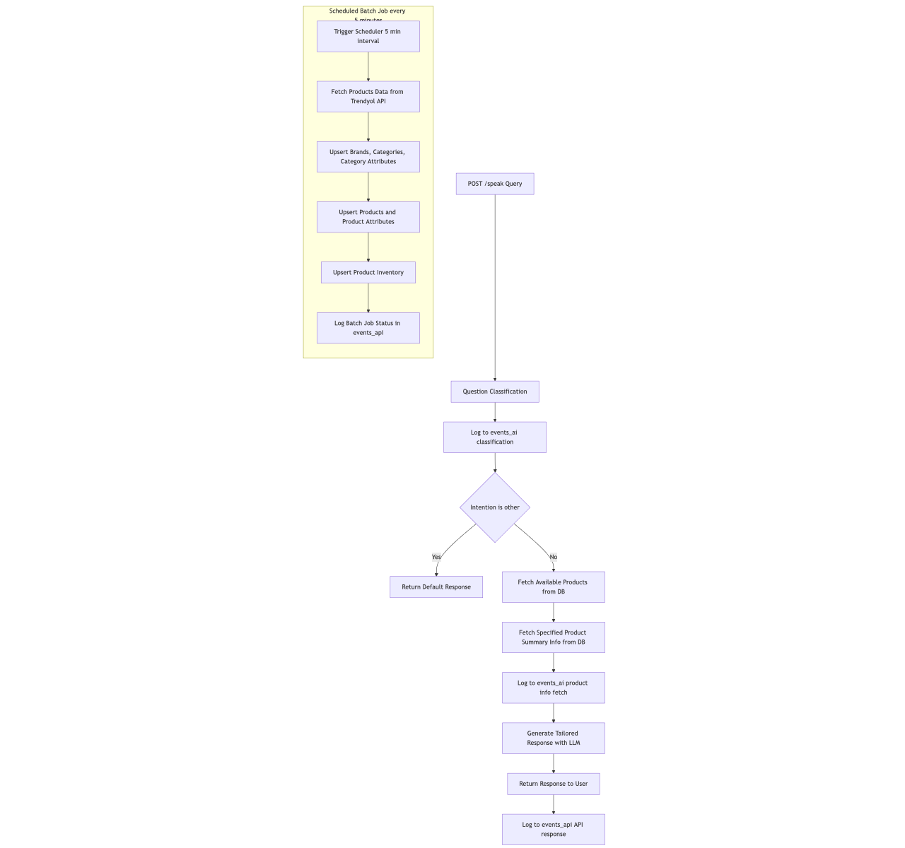
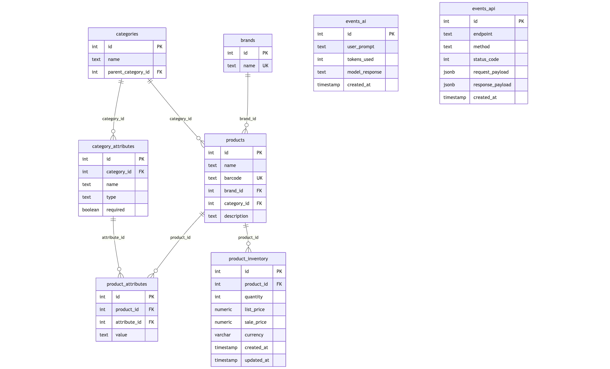

# Trendyol Product Info API

Bu proje, Trendyol ürün bilgilerini yönetmek ve kullanıcıların ürünlerle ilgili sorgularına yanıt vermek üzere tasarlanmış bir FastAPI tabanlı backend uygulamasıdır.  
API, ürün sorgularını doğal dil işleme (LLM) ile analiz edip yanıt verirken, arka planda Trendyol’dan düzenli olarak ürün verisi çekip PostgreSQL veritabanına kaydeder.

---

## Özellikler

- **Doğal dil işleme destekli ürün sorgulama**  
  Kullanıcıların ürünle ilgili sorularını sınıflandırır (stok durumu, kategori, ürün özellikleri, marka sorgusu vb.)  
  Sorguya uygun veritabanı bilgilerini çekip anlamlı cevaplar üretir.

- **Fallback (geri dönüş) mekanizması**  
  Sınıflandırma (classification) mekanizması sayesinde yanlış veya desteklenmeyen konulara yanıt verilmesi engellenir.  
  Bu sayede gereksiz API kullanımı azaltılır ve sistem kaynakları daha verimli kullanılır.  
  Eğer sınıflandırılan niyet `other` ise, kullanıcıya önceden belirlenmiş anlamlı bir fallback mesajı döner.

- **Scheduled batch job**  
  Trendyol’dan ürün, marka, kategori ve stok bilgilerini her 5 dakikada bir çeker ve veritabanına işler.

- **Event logging**  
  AI ve API event’leri ayrı tablolar (`events_ai` ve `events_api`) olarak PostgreSQL’e kaydedilir.

- **PostgreSQL veri modeli**  
  Markalar, kategoriler, ürünler, ürün özellikleri ve stok bilgileri için normalize edilmiş tablolar.

---

## Teknolojiler

- Python 3.9  
- FastAPI  
- SQLAlchemy 2.x  
- PostgreSQL  
- Together AI (LLM)  
- Docker & Docker Compose  
- APScheduler (batch job için opsiyonel)

---

## Kurulum

### 1. Ortam değişkenlerini ayarlayın

`.env` dosyasına PostgreSQL ve Together API anahtar bilgilerinizi ekleyin:

```env
DB_USER=example_user
DB_PASS=example_pass
DB_HOST=example_host
DB_PORT=example_port
DB_NAME=exapmple_db_name
```
TOGETHER_KEY=your_api_key_here


2. Docker ortamını başlatın
```bash
docker-compose up --build
```
Compose Sırasında Yapılanlar:
    1-db servisi PostgreSQL veritabanını çalıştırır.
    2-trendyol_api servisi FastAPI uygulamasını başlatır.
  
3. API endpoint’lerine erişin
Swagger UI: http://localhost:8000/docs
/speak endpoint’ine POST isteği göndererek ürün sorguları yapabilirsiniz.

Kod Akış Şeması



DB Şeması
